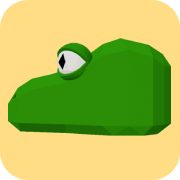

# Soonkae Game
<a href="https://soonake-game.vercel.app//" target="_blank">
 
</a> 

## Introduction
- Date: October 2022 to Febraury 2023
- Personal project in 'Introduction of Computer Graphics' class

## Features
- The head of Snake is initially placed at a random spot.
- The snake is controlled by arrow keys / swiping gestures(touchscreen).
- The snake moves forward one unit every 250ms.
- When the snake eats food, its body grows by one unit and the position of the food changes.
- The food is placed at a random point that does not overlap with the snake's position.
- The game ends when the snake hits a wall or intersects with his body.
- Users can change the concept of the background design: Easter, Summer, Halloween, and Winter.

## Built with

* Vite.js provided by [Three.js journey](https://threejs-journey.com/)
* Icons from [FontAwesome](https://fontawesome.com/)
* Swiping gestures for touch devices from [Hammer.js](https://hammerjs.github.io/)
* Animation from [GSAP](https://gsap.com/)